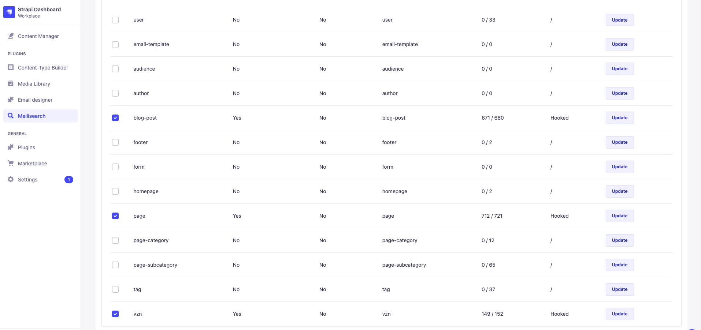

# Bratislava.sk setup, development and deployment

You should find all the necessary info about getting up & running as well as instructions about deployment in the [github README files.](https://github.com/bratislava/bratislava.sk)

## Meilisearch setup per environment

If you are looking to run a Meilisearch instance locally look to the [Meilisearch](../meilisearch.md) part of the docs. If you don't need to change the search configuration and need the search results only to work on the frontend code, connecting to staging meilisearch instance - https://bratislava-strapi-meilisearch.staging.bratislava.sk - works reasonably well (beware, though, that this will not reflect your local data if used alongside local Strapi instance).

On each of our instances the following manual index setup is required - this needs to be done after both the Strapi and Meilisearch instances are up and running. Read more on this topic in the [Meilisearch](../meilisearch.md) section of the docs.

The following content types need to be indexed in the [meilisearch-strapi-plugin](https://github.com/meilisearch/strapi-plugin-meilisearch): `blog-post`, `page`, `vzn`



Additionaly the following index setup is required (replace the instance and the MASTER_KEY as needed, the instance below is for production meilisearch server):

```bash
curl --request PATCH \
  --url https://bratislava-strapi-meilisearch.bratislava.sk/indexes/vzn/settings \
  --header 'Authorization: Bearer MASTER_KEY' \
  --header 'Content-Type: application/json' \
  --data '{
	"sortableAttributes": ["title","validFrom", "publishedAt"]
}'
```

```bash
curl --request PATCH \
  --url https://bratislava-strapi-meilisearch.bratislava.sk/indexes/blog-post/settings \
  --header 'Authorization: Bearer MASTER_KEY' \
  --header 'Content-Type: application/json' \
  --data '{
	"sortableAttributes": ["title", "publishedAt"]
}'
```

```bash
curl --request PATCH \
  --url https://bratislava-strapi-meilisearch.bratislava.sk/indexes/blog-post/settings \
  --header 'Authorization: Bearer MASTER_KEY' \
  --header 'Content-Type: application/json' \
  --data '{
	"filterableAttributes": ["locale"]
}'
```

```bash
curl --request PATCH \
  --url https://bratislava-strapi-meilisearch.bratislava.sk/indexes/page/settings \
  --header 'Authorization: Bearer MASTER_KEY' \
  --header 'Content-Type: application/json' \
  --data '{
	"filterableAttributes": ["locale"]
}'
```
