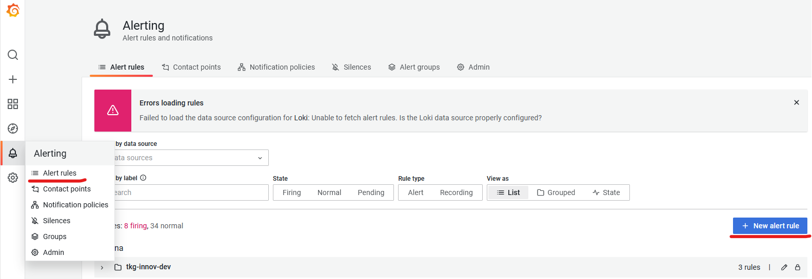
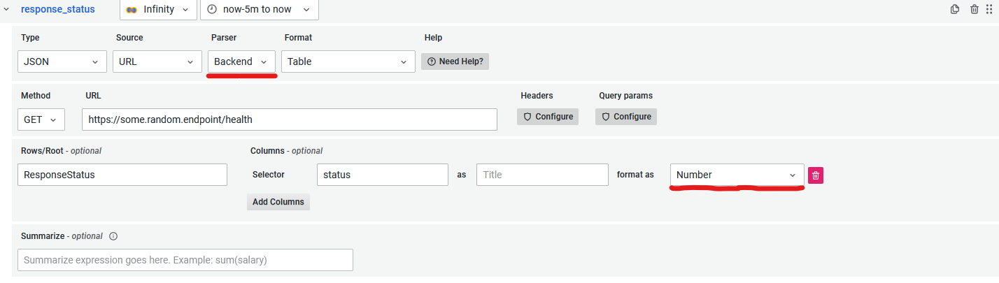
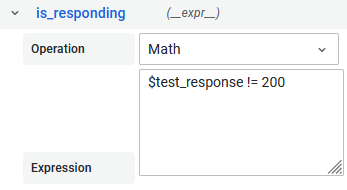
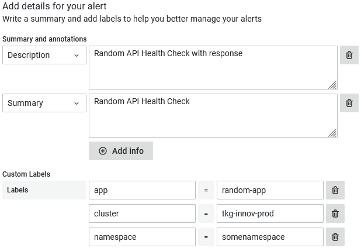

# Alerting on Endpoint Availability or Request Data (HTTP Request)

Sometime you want to monitor endpoint that your application exposes, such as various health endpoints and/or the data those endpoints provide. For this, use-case we use [Infinity](https://grafana.com/grafana/plugins/yesoreyeram-infinity-datasource/) data source that provides simple capabilities on making requests to endpoints and parsing the JSON response data.

To create such an alert we need to

  1. First go to [Alert section](https://grafana.bratislava.sk/alerting/list) in Grafana (bell icon on the left menu). Then hit the "+ New alert rule" button.
  

  2. Fill in the metadata of rule
      - `Rule name`, give it what ever you feel is descriptive
      - `Folder`, select based on the cluster
      - `Group`, you can put anything in place of a group, like project name  
    _Bear in mind that all alerts within the same group will be evaluated at the same time. So, if you are planing on creating more alerts for one project, we would suggest to give it the name of that project_
  3. Select "Infinity" as data source. Optionally, we can also change name of expression from "A" to maybe something more descriptive
  4. The only thing we **need** to specify is `Parser` field to be `"Backend"`. Also note, that for alerting, Infinity supports [only JSON queries](https://sriramajeyam.com/grafana-infinity-datasource/wiki/limitations/)
  5. Then just fill out the URL. Select method that you want (GET, POST) and fields to parse out from the JSON response based on what you want to check
  

        _Note, Grafana can only work and alert on numeric responses, therefore your endpoint has to return some sort of a number_

  6. Next, we need to add "Math" expression where we check our whether response is correct. In our example case, we want alert if response status is not `200`
  

  7. We need to define alert condition. Select the name of our "Math" expression and set check interval (`Evaluate`) and for how long should the alert be pending before firing (`for`).
  7. Lastly, we want to add some description and summary to our alert, with some custom labels, that would help us to better specify what is going on, when we receive the alert notification
  

And that is it. Now you can just **"Save and exit"**, and your alert should be running, and firing in case of any issues.  
The default contact point is through Slack to `grafana-alerting` channel. If you want to receive your alerts somewhere else or through some other means, please checkout ["How to add Contact Point"](./contact-point.md) recipe.

## Examples
  
  - [Infinity alert](https://grafana.bratislava.sk/alerting/grafana/FpIQuG44z/view?returnTo=%2Falerting%2Flist%3Fview%3Dgrouped) complex health check on application endpoint
