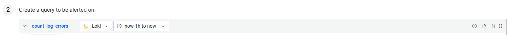
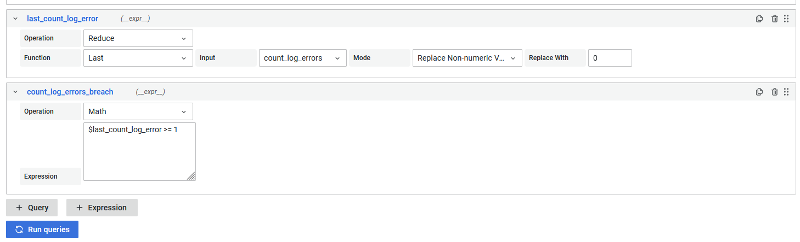
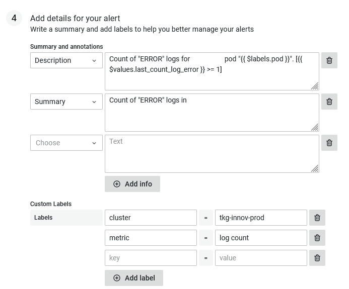

# Alerting on Application Logs

In this section we discuss how to build a alert on top of your application logs. As an example, we will use fire a alert, when we see `"ERROR"` keyword in the logs of our application.  
To build such a log alert we need to 

  1. First go to [Alert section](https://grafana.bratislava.sk/alerting/list) in Grafana (bell icon on the left menu). Then hit the "+ New alert rule" button.
  

  2. Fill in the metadata of rule
      - `Rule name`, give it what ever you feel is descriptive
      - `Folder`, select based on the cluster
      - `Group`, you can put anything in place of a group, like project name  
    _Bear in mind that all alerts within the same group will be evaluated at the same time. So, if you are planing on creating more alerts for one project, we would suggest to give it the name of that project or something similar_

  3. Next, in the second section we need to change the dataset from "Prometheus" to "Loki". Optionally, we can also change name of expression from "A" to maybe something more descriptive.
  4. We also need to change the time span on which we are going to alert on. We need to select `"now-1h to now"`, other options are not available or not work well in the current Grafana implementation ([Issue #48913](https://github.com/grafana/grafana/issues/48913))
   
  5. Now for the hard part, we need to build [Loki query](https://grafana.com/docs/loki/latest/logql/). The query language can do a lot of things, but for monitoring on simple phrases we just need a simple expression that selects our application within `{}`, wrapped in `count_over_time` function.  
  `count_over_time({cluster="tkg-innov-prod", namespace="standalone", app="example-app"} |= "ERROR" [10m])`  
  After `{}` selection, we have `|=` operator, which matches exactly the expression "ERROR". But, we can also do `|~` operator, which is capable matching on regex expressions.  
  This expression select logs only for our specific application then matches the string "ERROR", and over time of 10 minutes counts the number of occurrences of that string.  
  _Note, that you can use "Explore" (compass icon in left menu) UI to build and test your queries._
  6. Then the process is very similar to the one that is describe in ["Alert on resources"](./resource_alert.md) section, steps 7. onwards. We need to create two more expressions, one with `Operation` "Reduce" and the next with `Operation` "Math".  
      - For "Reduce", we want to select "Last" function, which _reduces_ our query to last know value  
      - For "Math", we want to put our [math expression](https://grafana.com/docs/grafana/latest/panels/query-a-data-source/use-expressions-to-manipulate-data/about-expressions/#math), in our case,
      we want to alert on **any one** occurrence of "ERROR". Meaning,  `$last_count_log >= 1` (notice, we renamed our "Reduce" expression to `last_count_log`, for better readability)
      

  7. We need define alert condition. Select the name of our "Math" expression and set check interval (`Evaluate`). Also, set for how long should the alert be pending before firing (`for`).
  8. Lastly, we give the alert description and summary, and if needed we put specific labels to help us quickly understand which error is firing when we get a notification.
  
  _Note, you can use [template](https://grafana.com/docs/grafana/latest/alerting/fundamentals/annotation-label/variables-label-annotation/) variables to customize your alert details, as seen on the picture above._

And that is it. Now you can just **"Save and exit"**, and your alert should be running, and firing in case of any issues.  
The default contact point is through Slack to `grafana-alerting` channel. If you want to receive your alerts somewhere else or through some other means, please checkout ["How to add Contact Point"](./contact-point.md) recipe.

## Examples

  - [Log alert](https://grafana.bratislava.sk/alerting/grafana/FuuQK0n4k/view?returnTo=%2Falerting%2Flist) on specific keyword. This is the example alert for one of our application, that fires every time we see the "ERROR" string in the logs of said application.
