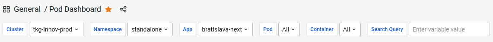
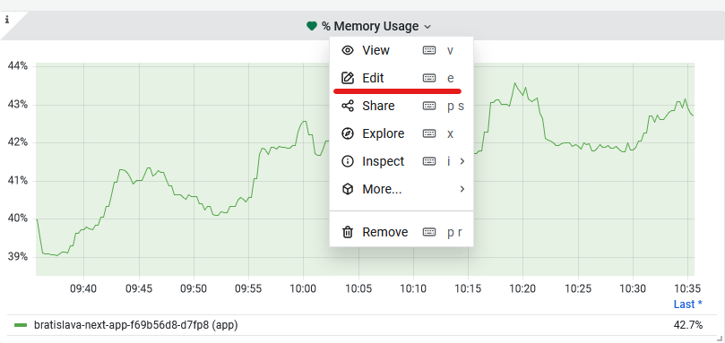
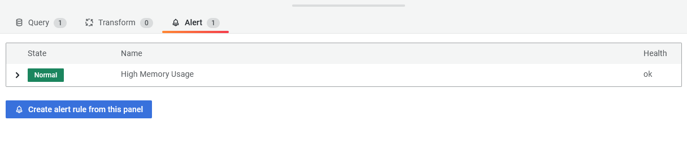
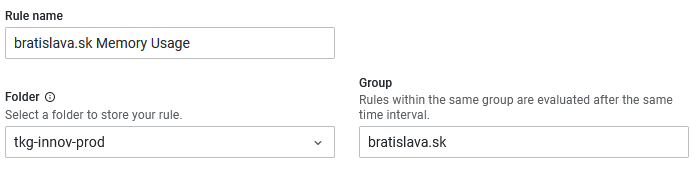
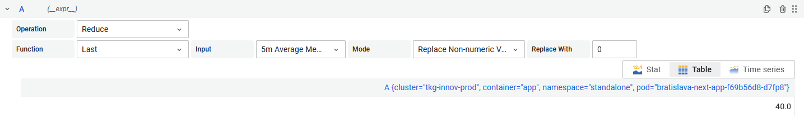
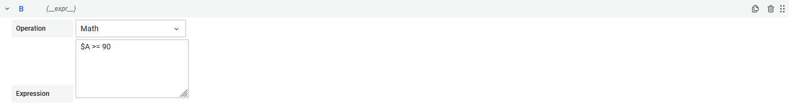
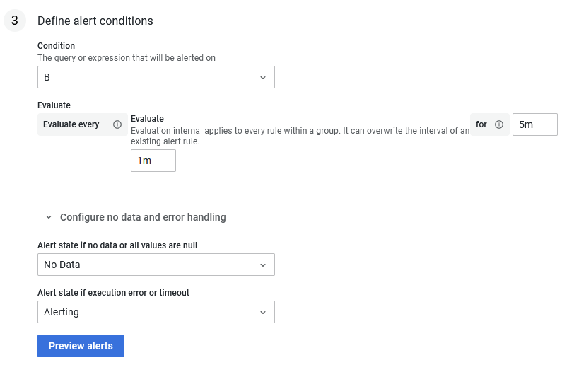
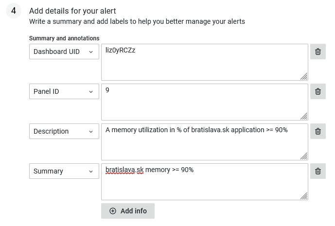
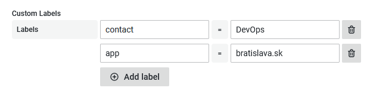

# Alerting on Resources Utilization

Your application inherently will have some limits, for instance, memory (RAM) or disk and it will probably be useful to alert in case, disk reaches 80% capacity. For this, use-case we use [Prometheus](https://prometheus.io/) data source that captures these metrics for individual instance spined up in our cluster.

The easiest way to create a alert on resource utilization is to visit any of our Grafana dashboard, that contains information you want to alert on. We recommend [Pod Dashboard](https://grafana.bratislava.sk/d/liz0yRCZz/pod-dashboard?orgId=1), in case of alerting on app/pod/container and will use it in following example, to alert on application high memory utilization.

So, to setup an alert for application, in our case let's say `bratislava-next-app` on `prod` cluster, when reaches 90% memory utilization, we need to

  1. Set the filters, on top of the page to the desired output. In our case it would be 
  

  2. Choose the panel that contains the information that we want alert on. Click on the name of the panel and hit `"edit"`
  

  3. There, you will see already prepared query, that will contain your information (cluster, pod, etc.). Select "Alert" in the menu 
  

  4. Now, you should see all existing alerts tied to the panel/chart. Hit the "Create alert rule from this panel" button
  5. If you get a message saying, to save the dashboard, hit Discard

This will open up a alert UI, where your query should be already filled in, with correct values from your filters.  
You can skip steps above if you know [Prometheus query language](https://prometheus.io/docs/prometheus/latest/querying/basics/) and just go directly to this UI through alert button in the left menu (bell icon) and fill in the query by your self.

  6. Now fill in the values, for
      - `Rule name`, give it what ever you feel is descriptive
      - `Folder`, select based on the cluster
      - `Group`, you can put anything in place of a group, like project name  
      _Note: bear in mind that all alerts within the same group will be evaluated at the same time. So, if you are planing on creating more alerts for one project, we would suggest to give it the name of that project_
    

  7. Now, we need to construct the alert expression. There should be already a expression called `A`, with selected `Operation` field "Classic condition". Let's change that to "Reduce" from the drop down menu
  8. As `Function` let's put "Last" and as `Input` select the query name above. This reduces the entire series only to the last know value. You can also choose, what to do with missing values, for example, replace them with specific value or keep them as `NaN`
  

  9. Click "+ Expression" button
  10. This should create a `B` expression. Let's select as `Operation`, option "Math", which will create a big text box where you can write [math expression](https://grafana.com/docs/grafana/latest/panels/query-a-data-source/use-expressions-to-manipulate-data/about-expressions/#math)

  11. You can use the query names as variables, so in our case we want to evaluate when expression `$A` is higher or equal to 90. Therefore, we write `$A >= 90`
  

That is almost it, we only need to setup alert condition.

  12. In a `Condition` field, we need to pick our "Math" expression name, in our case "B"
  13. Choose evaluation interval and for how long we want the alert to be in a "Pending" state before it starts firing  
    _If you are wondering where this is useful, it might be that in some case you have very volatile metric, like CPU utilization. This can go rapidly up and then in a minute go again down to normal levels. You might not want alert every time this happens, but put the alert in a "Pending" state and check latter if the metric is still in breach of the condition or it is back "Normal"_

  14. You can also select with you want to alert when data are missing or it is desired state
  

Now, we are done with the alert and you can "Save and exit", and the alert would start going. But it might be beneficial to put some more information about it. You can do it the next section and put there some `Description` and `Summary`. 

Also, put some other specific `labels`, which you can also then use to specify in a [contact point](./contact-point.md) to target your alerts. Something like  

_Note: by default any labels from your query will be also assign to your alert, for instance, stuff like `app`, `pod`, `cluster`, etc. You can use these as variables in your summary and description through [templates](https://grafana.com/docs/grafana/latest/alerting/fundamentals/annotation-label/variables-label-annotation/). This is useful when your query encapsulates multiple applications, you can use these variables to specify for which application the alert if firing._

And that is it. Now you can just **"Save and exit"**, and your alert should be running, and firing in case of any issues.  
The default contact point is through Slack to `grafana-alerting` channel. If you want to receive your alerts somewhere else or through some other means, please checkout ["How to add Contact Point"](./contact-point.md) recipe.

## Examples

You can take a look on following examples of application and kubernetes node resource alerting
  - [Prometheus alert](https://grafana.bratislava.sk/alerting/grafana/EUbLIt74z/view?returnTo=%2Falerting%2Flist%3Fview%3Dgrouped) on application resources. It check all deployed application on prod cluster if their long term memory usage is >= 90%
  - [Prometheus alert](https://grafana.bratislava.sk/alerting/grafana/Ka5g2074k/view?returnTo=%2Falerting%2Flist) on kubernetes node resources. Checks long term memory usage of kubernetes worker nodes, if their utilization is >= 90%
