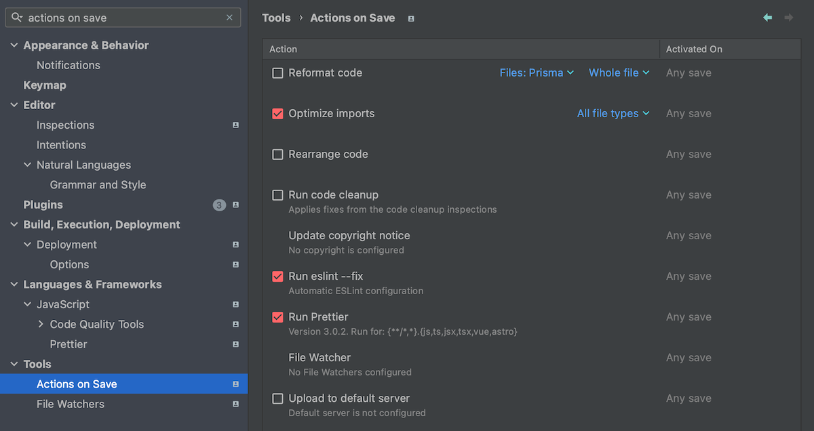
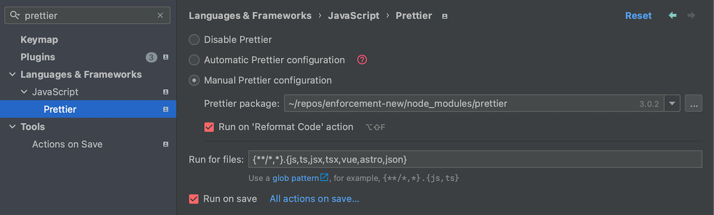
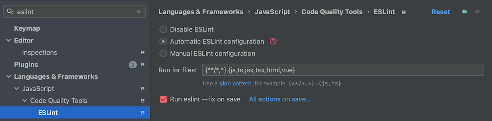

# Editor setup

import { Callout } from "nextra/components";

<Callout emoji="🙏️">
  Regardless of the editor you use, you should always **format and lint** your code **on save**, or at least before committing.
  Formatting and linting should be performed by **locally installed Prettier and ESlint** to prevent inconsistencies.
  We have no lint-staged or CI checks set up for this, so it's up to each developer to keep the code clean.
</Callout>

## Visual Studio Code

We recommend using [Visual Studio Code](https://code.visualstudio.com/) with the following settings and extensions.

If you prefer a different editor, it's completely fine. Still, you should find the counterparts of the extensions and setup mentioned above
that help you with formatting and a suitable typescript integration (which is a part of default VS Code installation).


### Setup formatting and linting
Install [Eslint](https://marketplace.visualstudio.com/items?itemName=dbaeumer.vscode-eslint) and [Prettier](https://marketplace.visualstudio.com/items?itemName=esbenp.prettier-vscode).

Open **User Settings (JSON)** and insert following lines:

```json filename="settings.json"
{
  // ...

  "editor.codeActionsOnSave": {
    // "source.organizeImports": true,
    "source.formatDocument": true,
    "source.fixAll.eslint": true
  },
  "files.insertFinalNewline": true,
  "javascript.preferences.importModuleSpecifier": "non-relative",
  "typescript.preferences.importModuleSpecifier": "non-relative",

  // optionally
  "files.autoSave": "onFocusChange"
}
```


- `organizeImports` removes all unused imports and sorts them, but it sometimes conflicts wit eslint, so you have to run it manually.
- `formatDocument` will run prettier, and `fixAll.eslint` will run eslint fix. The order of these commands is important.
- `files.insertFinalNewline` will add a new line at the end of the document.
- `...preferences.importModuleSpecifier` will make sure you always use absolute imports, which is a good practice.

<Callout emoji="ℹ️" type="info">
  If you find workaround how to run `organizeImports` without sorting, just for removing of unused imports, let us know!\
  Also if you have some suggestions for better settings, or other useful plugins, reach out to us. :)
</Callout>


### Extensions

These are not crucial, but either they improve dev experience, or they may help prevent some common mistakes.

- [Path Intellisense](https://marketplace.visualstudio.com/items?itemName=christian-kohler.path-intellisense) - for filename autocompletion
- [Code Spell Checker](https://marketplace.visualstudio.com/items?itemName=streetsidesoftware.code-spell-checker) - for spell checking your code, etc.
- [DotENV](https://marketplace.visualstudio.com/items?itemName=mikestead.dotenv) - for .env files syntax highlighting
- [Markdown All in One](https://marketplace.visualstudio.com/items?itemName=yzhang.markdown-all-in-one) - for easier reading of .md files
- [YAML](https://marketplace.visualstudio.com/items?itemName=redhat.vscode-yaml) - for yaml and kubernetes syntax support

For frontend devs:
- [Tailwind CSS Intellisense](https://marketplace.visualstudio.com/items?itemName=bradlc.vscode-tailwindcss) - for frontend devs
- [Auto Rename Tag](https://marketplace.visualstudio.com/items?itemName=formulahendry.auto-rename-tag) - for easier React and html tags renaming
- [Auto Close Tag](https://marketplace.visualstudio.com/items?itemName=formulahendry.auto-close-tag) - for automatically inserting closing tag
- [Reactjs code snippets](https://marketplace.visualstudio.com/items?itemName=xabikos.ReactSnippets)

Other useful extensions:
- [GitLens](https://marketplace.visualstudio.com/items?itemName=eamodio.gitlens) - git blame, history, commit graph, etc.
- [Peacock](https://marketplace.visualstudio.com/items?itemName=johnpapa.vscode-peacock) - for coloring of different project windows

### Example of settings.json

This is how your full User Settings could look like:

```json filename="settings.json" copy
{
  "files.autoSave": "onFocusChange",
  "files.insertFinalNewline": true,
  "editor.fontFamily": "Fira Code",
  "editor.fontLigatures": true,
  "editor.formatOnSave": true,
  "editor.formatOnPaste": true,
  "editor.insertSpaces": true,
  "editor.tabSize": 2,
  "editor.accessibilitySupport": "off",
  "editor.defaultFormatter": "esbenp.prettier-vscode",
  "editor.codeActionsOnSave": {
    "source.formatDocument": true,
    "source.fixAll.eslint": true
  },
  "prettier.enableDebugLogs": true,
  "prettier.printWidth": 100,
  "prettier.jsxSingleQuote": true,
  "prettier.semi": false,
  "files.associations": {
    ".env.bratiska-cli-build.*": "dotenv"
  },
  "diffEditor.ignoreTrimWhitespace": false,
  "editor.inlineSuggest.enabled": true,
  "typescript.suggest.autoImports": true,
  "javascript.preferences.importModuleSpecifier": "non-relative",
  "typescript.preferences.importModuleSpecifier": "non-relative",
  "svg.preview.mode": "svg"
}

```

## WebStorm

If you use WebStorm, make sure to run eslint and prettier on save (or at least before commit).

### Setup

Below are the setting that worked for me. You have to enable eslint and prettier, and set them to run on save.

<Callout emoji="⚠️" type="warning">
  Other combination of checked options may lead to inconsistencies. I also added `json` to be formatted by prettier,
  and I have to choose prettier for each project manually.
</Callout>







### Plugins
- [ESLint Restart Service Action](https://plugins.jetbrains.com/plugin/14119-eslint-restart-service-action)
- [.env files support](https://plugins.jetbrains.com/plugin/9525--env-files-support)
- [MDX](https://plugins.jetbrains.com/plugin/14944-mdx) - ⚠️ it has a bug that adds new line before imports in `.mdx` files on each run of `Optimize Imports` actions
- [GraphQL](https://plugins.jetbrains.com/plugin/8097-graphql)
- [GitToolBox](https://plugins.jetbrains.com/plugin/7499-gittoolbox)
