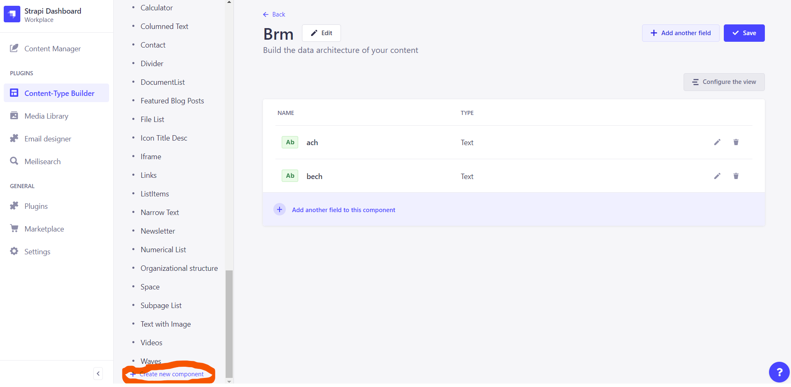

# Add a new component to Sections

These are the steps for adding a newly designed reusable visual component to the application - both as a Strapi component usable in `Page` and `BlogPost` sections and as a React Component in next codebase.

A higher level overview for this can be found in [our Strapi docs](./../strapi/general-concepts) or in official Strapi docs.

> ATTENTION Currently you **always** have to add the Strapi component to both `BlogPost` and `Page` sections. Otherwise you'll see an error like this: `Cannot read properties of undefined (reading 'type')` when you run `yarn gen`

# 1. Add component to strapi

- go to this location in strapi
  http://localhost:1337/admin/plugins/content-type-builder/content-types
- there you can see the `COMPONENTS` section at the bottom of the sidebar
- click on 'add new component' button. If you can't see it verify you are running Strapi server locally and in dev mode. In this guide we are assuming you are creating a new "Section" - thus, add the component under the `Sections` category.



- create a component based on your data type. For example, if you want to create a component for a list of documents, you can create a component with the following fields:
  - `title` - text
  - `documents` - relation to `Document` content-type
- after creating the component add the component into the `collection-type` located in sidebar aswell, as shown below in image (taken from v3 Strapi, should be similar in v4).


# 2. add or update the query to grab newly created component in strapi

- you can use GraphiQL to get the exact format of your query - check out the [graphql docs](../../graphql.md#exploring-graphql-schema)
- continuing with the example above, assuming your component is named `DocumentsList` you would add something like this the `Section` fragment definition (inside `next/graphql/queries/Pages.graphql`):

```graphql
fragment Sections on PageSectionsDynamicZone {
  __typename

  # ... other sections

  ... on ComponentSectionsDocumentList {
    id
    title
    documents {
      id
      title
      slug
      description
      document {
        id
        url
        alternativeText
        caption
        width
        height
        formats
      }
    }
  }
}
```

- regenerate your graphql client & types by running `yarn gen` in the `next` directory of the project - more info once again [in the graphql docs](../graphql)
- your data should be available on the gql client and typed correctly

# 3. Map the data from the query to a React component

- add a new `case` to the `switch` clause in `Sections.tsx`, matching the `__typename` of your newly created component - typescript will understand this, and in the body of this clause you should be able to safely access all the fields of your Strapi component
- for a better example of this, check out either the `Sections.tsx` file directly within the `bratislava.sk` repository or look into [our Strapi general concepts docs](./../strapi/general-concepts).
