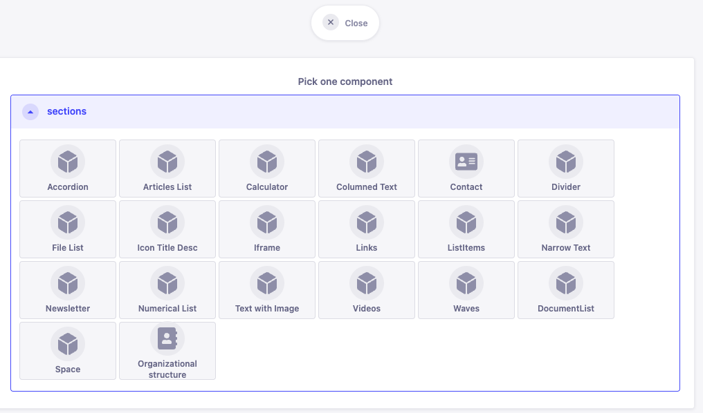

# General Concepts

import { Callout } from 'nextra/components'

<Callout emoji="🕰️">
  Some of the content on this page may be outdated.
</Callout>

We use [Strapi](https://strapi.io/) as our Headless CMS, from which we pull data into Next.js frontend via GraphQL.

If you are not a developer and are interested primarily in managing content within Strapi, [this Strapi user guide on Content Manager](https://docs.strapi.io/user-docs/latest/content-manager/introduction-to-content-manager.html) is a good start.

The rest of this section will talk about the basic concepts of modelling our data within Strapi and the way we pull it into our frontend applications.

## Basic concepts of a headless CMS

A headless CMS like Strapi, as opposed to a 'regular' CMS like Wordpress, does not send us a finished, styled webpages, but sends only raw data to our frontend (our Next.js application) - based on the format and contents of this data we decide what to render.

You can read more in [this Strapi article](https://strapi.io/what-is-headless-cms)

Let's distinguish two use-cases from our page ecosystem to illustrate this.

### "Template" content - pages & entities which always display the same data model

A straightforward application of the Headless CMS concept is when we have a template page on our frontend and we just fill it with data coming from Strapi. An example of this are "Events" from city-library.


Each of the Event pages contains a cover image, date, title, a rich-text field for text detail, and a few other fields. To implement this, Event is first created as a [content-type model](https://docs.strapi.io/developer-docs/latest/development/backend-customization/models.html#content-types) within our Strapi server and populated with all the fields we may require (again, refer to Strapi docs). Instances of the Event model are then pulled into our frontend app using GraphQL.

For more info on GraphQL, getting the GraphQL data into React and browsing the gql queries [see the appropriate section](../graphql).

In this use-case, data is always 'consumed' by the same React component(s).

### Dynamic content with Strapi CMS

Sometimes we want a more 'page-builder' like experience as a Strapi administrator - we may want to add various different React components (think rich-text, tables, galleries, accordions...) to the page or article we are writing, and have control over the order in which they appear. To do this, we are using [Strapi components](https://docs.strapi.io/user-docs/latest/content-types-builder/configuring-fields-content-type.html#components) - not to be confused with React components, these are simply reusable data models or in other words combinations of several Strapi data fields - which we then place into [Dynamic Zones](https://docs.strapi.io/user-docs/latest/content-types-builder/configuring-fields-content-type.html#dynamic-zones) within their parent content-type. You can see how Dynamic Zones are fetched with GraphQL [here](https://docs.strapi.io/developer-docs/latest/developer-resources/database-apis-reference/graphql-api.html#fetch-dynamic-zone-data).

On React's side, we then need to map each Strapi Component instance to an instance of a React component which can render it's data. There is usually a one-to-one mapping between the `__typename` field fetched via gql and a React component. A good example of this is the `Sections.tsx` file from bratislava.sk page:

```tsx showLineNumbers copy
const SectionContent = ({ section, locale }: { section: SectionsFragment; locale?: string }) => {
  const { t } = useTranslation("common")
  switch (section.__typename) {
    case "ComponentSectionsNarrowText":
      return (
        <NarrowText
          align={section.align ?? undefined}
          content={section.content ?? undefined}
          width={section.width ?? undefined}
          hasBackground={section.hasBackground ?? false}
        />
      )

    case "ComponentSectionsIconTitleDesc":
      return (
        <RentBenefits
          title={section.title}
          list={section.list}
          linkLabel={t("readMore")}
          hasBackground={section.hasBackground ?? false}
        />
      )

    case "ComponentSectionsDocumentList":
      return <DocumentList />

    case "ComponentSectionsColumnedText":
      return (
        <ColumnedText
          content={section.content ?? ""}
          hasBackground={section.hasBackground ?? false}
        />
      )
    // ... and many more sections cases
  }
}

const Sections = ({
  sections,
  locale,
}: {
  sections: (SectionsFragment | null)[]
  locale?: string
}) => {
  return (
    <>
      {sections.map((section, index) => (
        // eslint-disable-next-line react/no-array-index-key
        <SectionContent key={index} section={section} locale={locale} />
      ))}
    </>
  )
}

export default Sections
```

Mapping the data this way, we'll get our page-builder experience - the CMS admins being able to add new dynamic React components (from a pre-defined set) to their articles by adding the matching Strapi component to lists of dynamic zones within Strapi.

#### Multiple dynamic sections

You may require multiple 'dynamic' sections within your content-types. I.e. `Page` model in bratislava.sk consists of `PageHeaderSections` and `Sections` - the first one is content rendered in Page Header, the other within the 'body' of the page. Page header has it's own set of components which works within this context and is distinct from the components rendered in the body.




#### Sharing the same components within multiple content-types

The above does not mean that for each dynamic section the set of Strapi components need to be distinct. I.e. the body of `Pages` and `BlogPosts` consists of the same set of elements, and subsequentially, the code for the two renders the same set of React components and their respective content-types allow for same set of Strapi Components in their Sections dynamic zone.

## Creating content-types and displaying it on frontend

The steps when adding a completely new entity model are roughly as follows:

- create a content-type within Strapi - good introduction [here](https://docs.strapi.io/user-docs/latest/content-types-builder/introduction-to-content-types-builder.html), project specifics within the docs of each of our projects as needed. Creating content-types modifies the code, therefore **you need to do this from a locally running instance, and commit the changes into git.**
- write the GraphQL query and generate code which fetches it with GraphQL Codegen - see our GraphQL docs(TODO)
- fetching the data in Next.js and displaying it within our frontend 'template' - see our GraphQL docs(TODO)

For a more concrete example [check out the guide for adding sections to bratislava.sk](../bratislava.sk/add-new-component-to-sections) - note that specifics may vary slightly from project to project.
