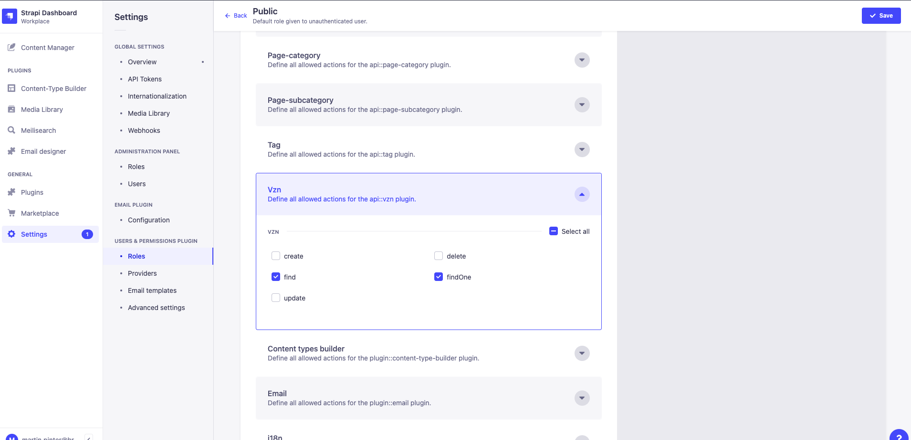

# Making Strapi content public = accessible without authentication

This needs to be done:

- when you set up a new instance or database, either locally or on a new deployment
- every time you add a new content type, on every deployment

Go to `Settings` -> `USERS & PERMISSIONS PLUGIN` -> `Roles` -> `Public` -> `Permissions`.

In all of your custom content types, particularly the newly added ones, make sure the following permissions are checked:

- find
- findOne (if available)

